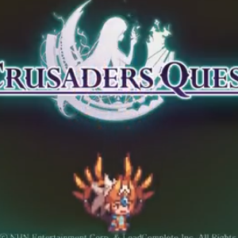

  

During the fall of 2016, I took ICS 111 at UHM.  We were assigned a project to create a class that involved animation.  The class required an image parameter and had functions that allowed it to move to a specific coordinate on the screen and rotate to a specific angle.  We further modified the class to be able to read from a .txt file.  Based on commands and coordinates in the text file, the "actor" object would carry out what we wished it to do.

This was an individual project and all code in this program was created by me, excluding the "EZJava.txt" file which was given to us by our Professor.  I started by creating the class called Actor, which contained the member functions "MOVETO" and "TURNTO."  One problem I had with this part was programming the MOVETO function.  After the object moved to the desired location, it would return to it's initial coordinates.  I eventually figured out that the problem stemmed from not saving the object's coordinates after it finished moving.  After verifying that the member functions worked correctly, I implemented a function called READ.  This function allowed the object to read from a .txt file and carry out a script instead of having to take input from the user or the main() function.  The project was very successful and I finished it with no errors in code.

I learned a lot about the fundamentals of Java from this project.  The project implemented classes, member functions, for loops, while loops, reading from files, and other concepts.  Although the code was fairly simple, I was proud of the final product.  It was great to see the text on the screen turn into a short animated film.  This project really helped spark my interest in computer science.

You can watch a demo of my project on [YouTube](https://www.youtube.com/watch?v=CfuakCWl06w).

