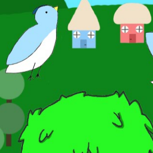

For our final project in ICS 111, my partner and I created a game called "Birdo Does a Fly."  In our game, you control a bird that has to jump over bushes or duck underneath vines to escape from a fox.  Unfortunately for the bird, there's no way to "win" the game.  The main objective is to get the highest score that you can.  The game itself is simple, you can either jump or duck by pressing "w" and "s", respectively.  However, a simple mistake in input can leave you with no time to be able to dodge the next obstacle.  All the images were created by a friend outside of our ICS class, who I am very grateful to as they spent their free time to help make our project look beautiful.

I worked on the player (the bird) class and the main class, along with my partner.  The player class needed to have the capability to jump and duck.  The object also needed to display different images based on what it was doing.  For example, it needed to show the correct images while jumping, walking, ducking, and falling.  After I finished the functions and properties of the player, we implemented everything we created in the main function.  We programmed the hitbox detection for the player, kept count of the score, and added a few sound files into the game.

I had a lot of fun working on this project.  It was less of an assignment and more of an activity.  I got to experience the basics of game design by thinking about hitbox detection, how to make the game challenging yet fair, and user experience.  Looking back, there were a lot of things that could've been refined but I think the game came out great for beginners to programming.  That feeling when the final product is complete is like no other.
