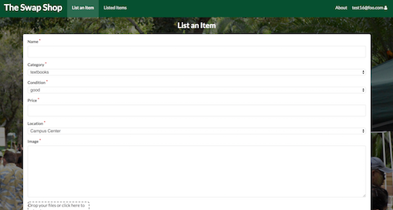

  

Teammates: Tyler Kikuyama and Kenneth Yamaguchi Townsend

We developed this application in Spring of 2018.  We were given a month to develop a web application in React & Meteor, which would eventually be hosted on Galaxy.

At the end of every semester, I always end up with textbooks and supplies that I no longer need and they end up collecting dust on my bookshelf.  I could sell it back to the bookstore, but the return rates are terrible.  Many college students are running on a tight budget, so we thought that it would be a great idea to develop an application where students and faculty would be able to sell supplies, essentially an online marketplace dedicated for UHM.

  

Our application allowed users to post listings for items they wished to sell.  To provide better safety for students and faculty, we had designated meeting places where the items would be exchanged.  We wanted to implement direct messaging between users, but with the deadline running close we had to settle on email as the primary means of contact between users.

I was assigned with developing the user profile page, admin functionality, accepting offers, and other UI designs.  One of the problems I came across was implementing a ban option for administrators.  We wanted admins to have the power to disable accounts if users were involved in inappropriate activites such as scamming.  However, with the way our internal account system was set up, we were unable to implement this feature into our application.

We had a lot of high ambitions for this project, but a lot of the features we were planning to implement had to be scrapped or trimmed down to match the system functionality and deadlines.  I learned that the software development process is very complicated and a lot of work needs to be done to implement the most simplest of ideas.  Teamwork was the most important key to developing our application.  We had assignments for each group member and some of which required other teammates to finish their part first in order to start the next step.  Our team worked efficiently to finish this project by the due date.

Here is a link to the [Github Organization Page](https://github.com/manoaswapshop).  Also, if you wish to view the documentation page for our project, click [here](https://manoaswapshop.github.io/)
